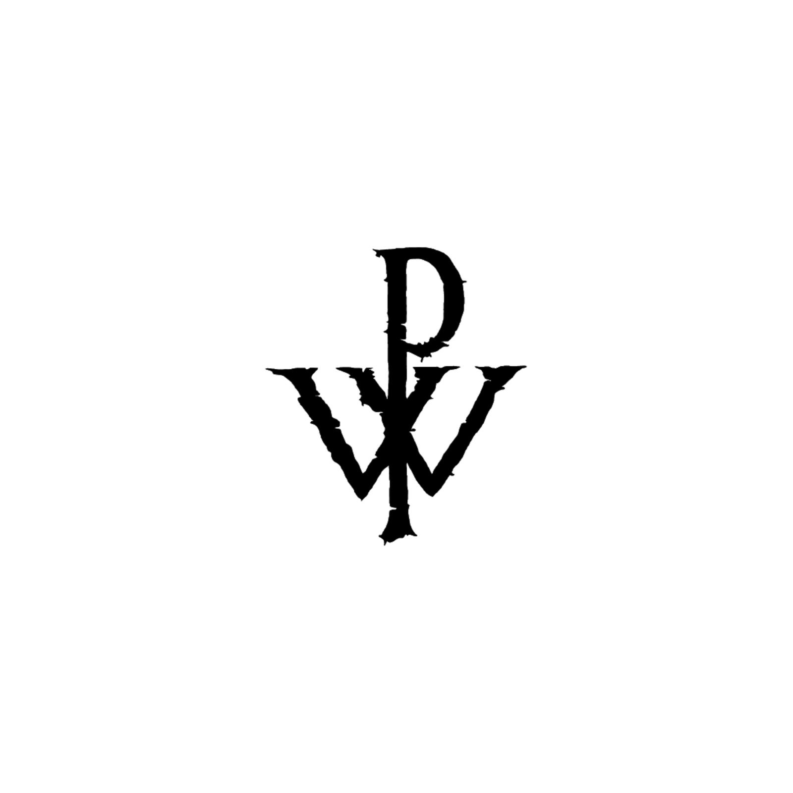

# Wtrcvck
# WTRVCK
[WTRVCK] version 1.2
WTRCVCK - Capteur de Frappe Navigateur
Ce logiciel de capteur de frappe dans le navigateur, nommé "WTRCVCK", est conçu pour un usage strictement privé et éducatif.

Description
"WTRCVCK" est un logiciel de capture de frappe dans le navigateur, développé pour des besoins personnels ou éducatifs. Il fonctionne discrètement pour enregistrer les frappes dans le navigateur dans un but spécifique, sans interférer avec d'autres applications ou activités.

Fonctionnalités Principales
Capture des frappes dans le navigateur de manière privée.
Utilisation strictement personnelle ou éducative.
Installation
Ce logiciel n'est pas destiné à une installation publique ou à une distribution générale. Il est conçu pour un usage privé et personnel.

Utilisation
L'utilisation de ce logiciel est destinée à des fins strictement personnelles ou éducatives. Les détails d'utilisation seront spécifiés dans la documentation interne.

Exemples
Pour des exemples d'utilisation ou de fonctionnement, veuillez vous référer à la documentation interne ou aux fichiers d'aide.

Contributions
Ce projet n'accepte pas les contributions externes en raison de son caractère privé et personnel.

Licence
Ce logiciel est sous licence privée. Toute reproduction ou distribution non autorisée est strictement interdite.

Contact
Développeur: Wharkly47
Email: wharklya@gmail.com

## Prix

Le prix du logiciel est de 89,70 €.

## Capture d'écran vidéo
<video width="320" height="240" controls>
  <source src="images/video.mp4" type="video/mp4">
  Votre navigateur ne supporte pas la lecture de vidéos.
</video>

## Paiement
<!DOCTYPE html>
<html lang="en">
<head>
  <meta charset="UTF-8">
  <title>Paiement</title>
  <link rel="stylesheet" href="styles.css">
</head>

<body>
<form action="https://www.paypal.com/cgi-bin/webscr" method="post" target="_top">
  <input type="hidden" name="cmd" value="_s-xclick" />
  <input type="hidden" name="hosted_button_id" value="NMMBZ63AVU6V4" />
  <table>
    <tr>
      <td>
        <input type="hidden" name="on0" value="Wtrvck"/>
        Wtrvck
      </td>
    </tr>
    <tr>
      <td>
        <select name="os0">
          <option value="Ce logiciel de capture de frappe, Wtrvck, est un outil de survei">
            Ce logiciel de capture de frappe, Wtrvck, est un outil de survei €89.70 EUR
          </option>
          <option value="Votre achat sera sécurisé via PayPal. Une fois le paiement effec">
            Votre achat sera sécurisé via PayPal. Une fois le paiement effec €89.70 EUR
          </option>
          <option value="Pour toute question ou support, contactez Wharkly47 sur GitHub (">
            Pour toute question ou support, contactez Wharkly47 sur GitHub ( €89.70 EUR
          </option>
        </select>
      </td>
    </tr>
  </table>
  <input type="hidden" name="currency_code" value="EUR" />
  <input type="image" src="https://www.paypalobjects.com/en_US/FR/i/btn/btn_buynowCC_LG.gif" border="0" name="submit" title="PayPal - The safer, easier way to pay online!" alt="Buy Now" />
</form>
</body>
</html>

